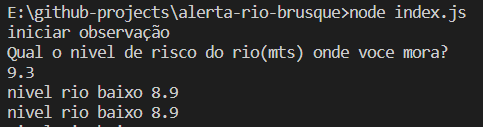

# Alerta nível rio Brusque

Node app para notificar com alarme, quando nivel de rio de Brusque(Ponte Estaiada) ultrapassar limite de risco informado.

### Como utilizar:
- Clonar repo:
```shell
git clone https://github.com/jozimarback/alerta-rio-brusque.git
```

- Iniciar app via node:
```shell
node index.js
```
- Informar valor em metros para monitorar:


Ao atingir valor um som de sirene ira tocar em sua máquina.